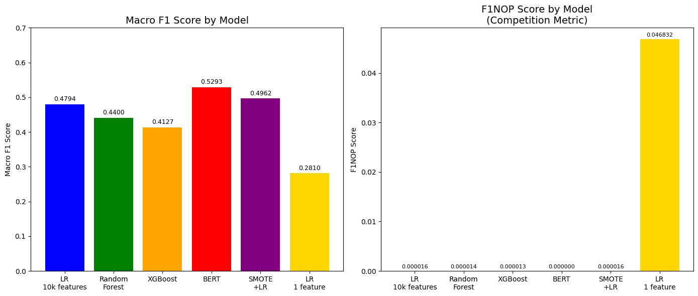

# Harmful Content Detection in English and Bengali Text

## 🏆 Achievement
2nd place - HerWILL AI for Digital Safety Global Datathon 2026
(Out of 41 international teams)

## 📌 Problem
Detecting harmful content in multilingual social media text
containing both English and Bengali language.

## 📊 Dataset
- 47,817 training samples
- 11,955 test samples
- 3 classes: Explicitly Harmful, Subtly Harmful, Neutral
- Multilingual: English + Bengali text

## 🤖 Models Tried
| Model | Macro F1 | NOP |
|-------|----------|-----|
| Logistic Regression (10k features) | 0.4794 | 30,003 |
| Random Forest | 0.4400 | 30,003 |
| XGBoost | 0.4127 | 30,003 |
| Multilingual BERT | 0.5293 | 177,855,747 |
| SMOTE + Logistic Regression | 0.4962 | 30,003 |
| Logistic Regression (1 feature) | 0.2810 | 6 |

## 🔑 Key Findings
- Competition metric (F1NOP) rewards model efficiency
- Smaller models outperform larger ones on F1NOP
- Multilingual BERT best for raw accuracy
- Class imbalance handled using class weights and SMOTE

## 🛠️ Libraries Used
- pandas, numpy
- scikit-learn
- transformers (BERT)
- imbalanced-learn (SMOTE)
- matplotlib
- xgboost

## 📈 Results
Final Score: 2.70705
Final Rank: 2nd out of 41 teams
## 📊 Model Comparison Chart

